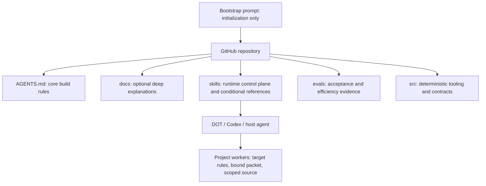

# Context ownership and loading

The bootstrap prompt initializes the repository once. Future work uses the repository's maintained entrypoints; it does not replay that prompt. The ErlichDotman workspace contains the `engineering-cascade` core; its existing package and repository names remain unchanged.

This is a context-ownership invariant, not a request to load every box. No default context includes the original prompt, all repository files, all references, research or evaluation traces.

## Entry paths

| Work | Start with | Expand only when |
| --- | --- | --- |
| Maintain this core | `AGENTS.md`, task, affected source/tests | Relevant implementation contract or behavior needs explanation; `CONTRIBUTING.md` supplies validation commands |
| Orchestrate another project | Selected `SKILL.md`, target task and fresh compact profile | A routing, context, skill, handoff or escalation decision needs a linked reference |
| Implement a project packet | Target project's applicable rules, bound packet, relevant code/tests | Required facts or interfaces are missing; return evidence and request targeted expansion |
| Analyze metrics or evaluate policy | Explicit evaluation task plus applicable tooling/contracts and `docs/EVALUATION.md` | The comparison requires specific datasets, traces or methods |
| Research architecture or dependencies | Specific research question and relevant primary-source notes | Evidence is needed for that question or license decision |

A skill description/catalog entry is discovery metadata. Loading its whole body is a separate selection decision. A link identifies an available resource; it does not instruct agents to follow every link. Workers do not inherit core build rules, the runtime control plane or upstream chat merely because the orchestrator used them. If the worker itself needs orchestration, select the skill for that task explicitly.

## Document ownership

- `AGENTS.md` owns durable constraints for changes to this core. It does not teach all engineering methodology or list current runtime policy thresholds.
- `SKILL.md` owns the portable decision sequence, boundaries and conditional reference routes. Its references explain operational choices and remain usable when the skill directory is copied alone.
- `docs/` owns rationale, implementation behavior, contributor validation, evaluation methods and deeper examples. It is not an automatic preload list.
- `docs/DECISIONS.md`, `docs/IMPLEMENTATION_PLAN.md` and `docs/BOOTSTRAP_RESULTS.md` are historical bootstrap records. `docs/RESEARCH.md` is optional attribution/research context. None directs routine execution.
- `src/`, the packaged schema and deterministic checks establish current behavior. The historical plan's interfaces and past test counts are snapshots, not live specifications.
- `evals/` holds task data/evidence; ignored `evals/results/` or `.cascade/` holds private raw traces. The skill keeps only an outcome-recording boundary, not benchmark or telemetry manuals.

Some short invariants intentionally appear in both build rules and the standalone skill: quality, project separation, authority boundaries and truthful usage. Their audiences may load either entrypoint alone. Detailed policy/telemetry lists should have one owner; explaining implementation rationale in docs is distinct from portable runtime guidance.

## Grounding, freshness and privacy

The user's task defines desired behavior. Inspect current code, schemas, relevant tests and validation results to establish actual behavior. When a summary conflicts, refresh it; never silently let memory redefine the repository. Match project/revision and relevant working-tree changes before reusing profiles. HEAD alone does not describe dirty edits. Automatic dirty-tree fingerprints remain future work; the host must provide fresh evidence today.

Public core instructions and synthetic examples stay in Git. Actual repository inventories, credentials, provider bindings, proprietary instructions and project profiles stay in ignored local state. Keep project boundaries even when the user requests reuse of a generic pattern: verify and restate it against the target project.

`context.select_context` already rejects mixed/stale items and requires necessary excerpts to fit. `skills.discover_skills` already reads sidecars without bodies. Neither function needs a redesign for this audit. The manual adapter does not control host prompt assembly or trim existing chat history; hosts must honor this load contract. A new task can begin from a compact grounded packet, but this library cannot promise to erase a host's conversation or system context.

## Footprint and quality

Run `python scripts/context_footprint.py --baseline <local-ref>` for reproducible character-based estimates. These counts include Markdown/frontmatter and exclude host prompts, catalogs and actual target source/tests. The report's normal-task example uses the synthetic profile/task in `examples/`; it is not a universal size limit or an observed host trace.

Target the core skill at roughly 500–1,500 tokens. Review large always-loaded instructions; allow required context to expand when evidence warrants it. Do not cap necessary interfaces, constraints or validators merely to lower a count. Compare accepted-task resource use including inference, retries, latency, intervention and rework before claiming a total-efficiency improvement. See the [audit evidence](CONTEXT_AUDIT.md) and the independent scenarios in `evals/context_architecture/`.
