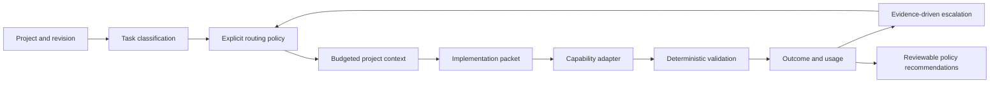

# Bootstrap decisions — 2026-09-30

Historical design rationale, loaded for architectural decisions only. Current source, packaged schemas and validation evidence define implemented behavior; this record is not default agent context.

The operator has many repositories and wants higher engineering value per inference resource, with correctness and maintainability preserved. The first milestone needs a usable skill, handoffs, explicit policy, deterministic checks, and an evaluation framework. It does not need a daemon or a hosted agent platform.

## Approach

1. **Skill alone:** easy to distribute, but cannot enforce isolation or measure outcomes. Insufficient for this milestone.
2. **Small Python core plus a skill (selected):** portable contracts, inspectable policy, offline tests, and explicit adapter boundaries. Python 3.11 offers mature testing and JSON tooling; one runtime dependency, `jsonschema`, avoids maintaining a partial schema validator.
3. **Autonomous multi-agent service:** scheduler, credentials, provider clients, and distributed state add risk before there is evidence routing helps. Deferred.

## Name and repository

Use **engineering-cascade** for the repository, package, CLI, and skill. It describes engineering stages and evidence-driven escalation without binding to a vendor or temporary model. Account inventory showed no matching project; targeted public GitHub search found no exact-name project. This is a naming check, not a trademark guarantee. The workspace was empty; the new repository lives in its own child directory. Public release is a separate authorization boundary.

Naming update, 2026-09-30: the operator chose **ErlichDotman** for the repository (`rms730/erlichDotman`) and portable skill (`erlichdotman`). The package and CLI retain their original names. The original naming research above concerns the bootstrap name.

## Contracts and flow

Version 1 JSON contracts cover project profiles, tasks, policy, context items, packets, skill metadata, decisions, and telemetry. The packaged JSON Schema is the source of validation truth. Unknown metrics use `null`.

The decision engine recommends work; it does not confer execution permission. A manual adapter emits a dispatch request when model selection is unavailable. No paid model execution is implemented initially. Bundled replay fixtures exercise actual edits and tests in temporary directories but use scripted patches, not model outputs.

## Quality and cost

Start at a category tier, apply explicit ambiguity, complexity, risk and signal floors, then escalate on failed attempts. Mechanical implementation can downgrade only after ambiguity and risk permit it. Tier 0 is reserved for tasks explicitly resolvable deterministically. Retry limits are finite. Context is project and revision scoped; missing required context stops the handoff rather than silently truncating it.

Optimize expected total cost only when calibrated data exists. The initial heuristic is a reviewable starting policy, not a learned cost optimizer. Feedback uses measured records with minimum sample thresholds; it recommends changes and never rewrites policy automatically.

## Evaluation boundary

Compare frontier-only, lightweight-only, intelligent routing, advanced-planning/lightweight-implementation, and progressive escalation. Separate routing-contract coverage from fixture execution. Report completion, first pass, retries, tiers, validation, interventions and available usage. No fabricated tokens, prices, or engineering-value score. Real model quality and cost claims require repeated held-out runtime trials.

## Security and scope

Trust labels describe provenance; they are not permissions. Skill discovery reads metadata, never installs or executes code. Context paths must stay within their project. Commands use argument arrays and bounded subprocess execution. An isolated working directory is not an OS security boundary; untrusted repositories require an external sandbox. Private state is ignored and omitted from public examples.
